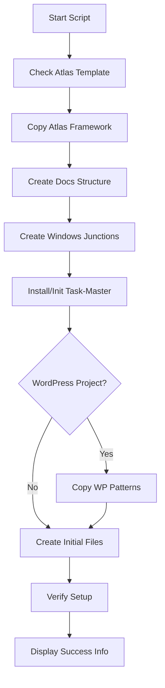

# 🤖 Automated Project Setup Guide

## Overview

The automated setup scripts (`new-project.sh` and `new-project.ps1`) create a complete project structure integrating Atlas brain, project documentation, Task-Master, and optional WordPress patterns.

## Required Directory Structure

For the scripts to work properly, you must have this structure in place:

```
/mnt/c/root/ (or C:\Users\[YourName]\Claude\root\)
└── .claude/
    ├── .scripts/
    │   ├── new-project.sh      # The setup script (bash)
    │   └── new-project.ps1     # The setup script (PowerShell)
    ├── .repos/
    │   ├── Software-Engineer-AI-Agent-Atlas/  # Atlas framework (required)
    │   ├── claude-task-master/                # Task-Master repo (optional)
    │   └── WordPress-AI-Commander/            # WP patterns (optional)
    ├── atlas/                    # Where Atlas brains will be created
    └── docs-projects/            # Where project docs will be created
```

### Prerequisites

1. **Atlas Repository**: Must be cloned in `.claude/.repos/`
   ```bash
   git clone https://github.com/syahiidkamil/Software-Engineer-AI-Agent-Atlas.git /mnt/c/root/.claude/.repos/Software-Engineer-AI-Agent-Atlas
   ```

2. **Node.js/npm**: Required for Task-Master installation
   ```bash
   # Check if installed
   node --version
   npm --version
   ```

3. **Git**: Required for version control
   ```bash
   git --version
   ```

4. **WordPress-AI-Commander** (optional): For WordPress projects
   ```bash
   git clone https://github.com/Idearia/WordPress-AI-Commander.git /mnt/c/root/.claude/.repos/WordPress-AI-Commander
   ```

## What the Scripts Do

### 1. **Atlas Brain Setup**
- Copies the complete Atlas framework from `.repos/Software-Engineer-AI-Agent-Atlas/`
- Creates a new `atlas-[project-name]` folder with full Atlas consciousness
- Preserves all Atlas core folders: `WORKING_LOG/`, `MEMORY/`, `SELF/`, etc.

### 2. **Documentation Structure**
Creates organized folders in `docs-projects/docs-theme-[project-name]/`:
- `current/` - Active development work
- `development/` - Architecture and planning docs
- `sessions/` - Session histories
- `archive/` - Old/completed work
- `historical/` - Historical documentation
- `backups/` - Project backups
- `specifications/` - Project specs
- `research/` - Research documents

### 3. **Windows Junctions**
Creates junctions in Atlas pointing to docs-projects:
```
atlas-[project]/current → docs-projects/docs-theme-[project]/current
atlas-[project]/development → docs-projects/docs-theme-[project]/development
atlas-[project]/sessions → docs-projects/docs-theme-[project]/sessions
atlas-[project]/archive → docs-projects/docs-theme-[project]/archive
```

**Why this approach?**
- Atlas doesn't require these folders but they're useful for organization
- Real folders live in centralized `docs-projects/` location
- Junctions provide convenient access from Atlas
- No duplication of files

### 4. **Task-Master Integration**
- Checks if Task-Master is installed globally
- If not, installs it: `npm install -g task-master-ai`
- Runs `task-master init` in the Atlas project folder
- Creates `.taskmaster/` configuration structure

### 5. **WordPress Patterns (Optional)**
- Prompts if this is a WordPress project
- If yes, copies patterns from `WordPress-AI-Commander/includes/tools`
- Places them in `atlas-[project]/scripts/wordpress-patterns/`

### 6. **Initial Project Files**
Creates starter files with project-specific content:

#### `CURRENT_STATE.md`
- Project working directory placeholder
- Environment status tracking
- Current focus section
- Auto-dated

#### `TODOS_ACTIVE.md`
- Initial setup tasks
- Next steps placeholder
- Blocked items tracking
- Auto-dated

#### `QUICK_RESUME.md`
- Resume commands for the project
- Key file locations
- Quick context summary
- Main files section

## Script Execution Flow



## Usage

### Bash Version (WSL/Git Bash)
```bash
./.claude/.scripts/new-project.sh project-name
```

### PowerShell Version
```powershell
.\.claude\.scripts\new-project.ps1 -ProjectName "project-name"
```

## Directory Structure Created

```
.claude/
├── atlas/
│   └── atlas-[project]/
│       ├── CLAUDE.md (Atlas brain)
│       ├── WORKING_LOG/ (Atlas memory)
│       ├── MEMORY/ (Atlas knowledge)
│       ├── SELF/ (Atlas identity)
│       ├── current → (junction to docs)
│       ├── development → (junction to docs)
│       ├── sessions → (junction to docs)
│       ├── archive → (junction to docs)
│       └── [initial project files]
│
└── docs-projects/
    └── docs-theme-[project]/
        ├── current/ (real folder)
        ├── development/ (real folder)
        ├── sessions/ (real folder)
        ├── archive/ (real folder)
        ├── historical/
        ├── backups/
        ├── specifications/
        └── research/
```

## Key Design Decisions

### Why Junctions in Atlas?
- **Convenience**: Access project docs from Atlas location
- **Compatibility**: Works with existing workflows
- **No duplication**: Single source of truth in docs-projects

### Why Real Folders in docs-projects?
- **Centralization**: All project docs in one searchable location
- **Organization**: Clear separation from Atlas brain files
- **Backup-friendly**: Easy to backup all project documentation

### Why Task-Master in Atlas?
- Task-Master expects to run in the project root
- Atlas folder serves as the "project root" for development
- `.taskmaster/` config lives alongside Atlas brain

## Troubleshooting

### Script Can't Find Atlas Template
**Error**: "Atlas template not found"
**Solution**: Ensure Atlas is cloned in `.claude/.repos/Software-Engineer-AI-Agent-Atlas/`

### Junction Creation Fails
- May require Windows admin privileges
- Script uses `cmd.exe` for Windows compatibility
- Uses `wslpath -w` to convert paths dynamically
- Falls back gracefully if junctions can't be created

### Paths Not Working
**Issue**: Script fails with path errors
**Solution**: 
- Ensure you're running from the correct location
- Scripts detect paths dynamically from their location
- Must maintain the required directory structure

### Task-Master Warnings
- Normal on first init - it's looking for config files
- Creates default configuration automatically
- Can be customized after setup

### WordPress Patterns Not Found
- Ensure WordPress-AI-Commander is cloned in `.repos/`
- Script continues without WP patterns if not found
- Can be added manually later

## Post-Setup Tasks

1. **Update CURRENT_STATE.md** with actual working directory
2. **Add project-specific information** to initial files
3. **Configure Task-Master** for your workflow
4. **Create initial git repository** if needed
5. **Start development!**

## Benefits of Automation

- **Consistency**: Same structure every project
- **Speed**: 1 minute vs 15+ minutes manual
- **Completeness**: Nothing forgotten
- **Error-free**: No typos in paths or commands
- **Integrated**: All tools work together immediately